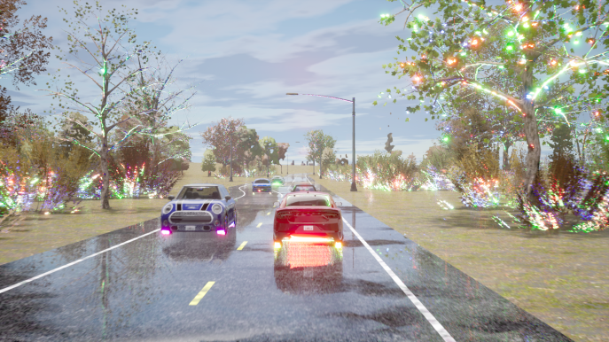

# Evaluation (10 minutes)

This guide covers local evaluation for getting started. For large-scale evaluation (running many routes in parallel), see the [SLURM Evaluation Guide](slurm_evaluation.md).

```{note}
Dataset download is not required for CARLA evaluation—only a trained model checkpoint is needed.
```

```{important}
LEAD must be installed as a package in your Python environment. Ensure you're in the correct environment before running evaluations.
```

## Overview

The [Quick Start](https://github.com/autonomousvision/lead?tab=readme-ov-file#quick-start) tutorial demonstrates evaluating a trained policy on a single Bench2Drive route. We provide a unified Python-based evaluation interface (`lead.leaderboard_wrapper`) that simplifies debugging and configuration for the three most popular benchmarks:

- **Bench2Drive**: See [official repository](https://github.com/Thinklab-SJTU/Bench2Drive) for benchmark details
- **Longest6 v2**: See [carla_garage](https://github.com/autonomousvision/carla_garage?tab=readme-ov-file#longest6-v2) for benchmark details
- **Town13**: See [CARLA Leaderboard 2.0 validation routes](https://github.com/autonomousvision/carla_garage?tab=readme-ov-file#carla-leaderboard-20-validation-routes)

```{warning}
Do not evaluate Longest6 v2 or Town13 routes using Bench2Drive's evaluation repository—the metrics definitions differ.
```

## Running Evaluations

### Prerequisites

1. **Activate your Python environment** where LEAD is installed
2. **Start CARLA server**:

```bash
bash scripts/start_carla.sh
```

### Direct Python Invocation

The simplest way to run evaluations is directly with Python:

**Model evaluation (Longest6/Town13):**
```bash
python lead/leaderboard_wrapper.py \
    --checkpoint outputs/checkpoints/tfv6_resnet34 \
    --routes data/benchmark_routes/Town13/0.xml
```

**Bench2Drive:**
```bash
python lead/leaderboard_wrapper.py \
    --checkpoint outputs/checkpoints/tfv6_resnet34 \
    --routes data/benchmark_routes/bench2drive/23687.xml \
    --bench2drive
```

**Expert mode (data generation):**
```bash
python lead/leaderboard_wrapper.py \
    --expert \
    --routes data/data_routes/lead/noScenarios/short_route.xml
```

### Configuration Options

Evaluation behavior is controlled by [config_closed_loop.py](https://github.com/autonomousvision/lead/blob/main/lead/inference/config_closed_loop.py). Key settings:

- `produce_demo_video` - Generate bird's-eye view visualization videos
- `produce_debug_video` - Generate detailed debug videos with sensor data
- `produce_demo_image` - Save individual demo frames
- `produce_debug_image` - Save individual debug frames

Disable video generation for faster evaluation:

```bash
export LEAD_CLOSED_LOOP_CONFIG="produce_demo_video=false produce_debug_video=false produce_demo_image=false produce_debug_image=false"
```

The `LEAD_CLOSED_LOOP_CONFIG` environment variable allows per-run configuration overrides without modifying the config file.

### Output Structure

Each evaluation produces:

```
outputs/local_evaluation/<route_id>/
├── checkpoint_endpoint.json      # Leaderboard 2.0 metrics and results
├── metric_info.json              # Bench2Drive extended metrics (Bench2Drive only)
├── demo_images/                  # Bird's-eye view frames
├── debug_images/                 # Debug visualization frames
├── <route_id>_demo.mp4          # Bird's-eye view video
├── <route_id>_debug.mp4         # Debug video with sensor data
└── debug_checkpoint/             # Debug checkpoints
```

## Summarizing Results

### Longest6 v2 and Town13

After completing all routes, aggregate results using the [result parser](https://github.com/autonomousvision/lead/blob/main/scripts/tools/result_parser.py):

**Longest6 v2:**
```bash
python3 scripts/tools/result_parser.py \
    --xml data/benchmark_routes/longest6.xml \
    --results <directory_with_route_jsons>
```

**Town13:**
```bash
python3 scripts/tools/result_parser.py \
    --xml data/benchmark_routes/Town13.xml \
    --results <directory_with_route_jsons>
```

This generates a summary CSV containing:
- Driving score (DS)
- Route completion (RC) percentage
- Infraction breakdown (collisions, traffic violations, red lights, etc.)
- Per-kilometer statistics

### Bench2Drive

Bench2Drive provides extended metrics beyond standard Leaderboard 2.0 metrics. See the [official evaluation guide](https://github.com/Thinklab-SJTU/Bench2Drive?tab=readme-ov-file#eval-tools).

Bench2Drive evaluation tools are located at [3rd_party/Bench2Drive/tools/](https://github.com/autonomousvision/lead/blob/main/3rd_party/Bench2Drive/tools/).

## Best Practices

### 1. Environment Setup

Always run evaluations with:
- LEAD installed as a package in your active Python environment
- Optional: `LEAD_PROJECT_ROOT` environment variable set to your workspace root
- CARLA server running on the expected port (default: 2000)


With sufficient compute (16-32 GTX 1080 Ti GPUs):
- **Longest6 v2**: ~1 day for 3 seeds (36 routes × 3 = 108 evaluations)
- **Town13**: ~2 days for 3 seeds (20 routes × 3 = 60 evaluations)

Approximately 90% of routes complete within a few hours. Disable video/image generation to accelerate evaluation.

### 2. Restart CARLA Between Routes

Running multiple routes on the same CARLA instance can cause rendering bugs (example from Bench2Drive paper):



Restart CARLA between routes:

```bash
bash scripts/clean_carla.sh  # Kill CARLA processes
bash scripts/start_carla.sh  # Start fresh instance
```


The pipeline loads all three checkpoint seeds as an ensemble by default. If GPU memory is limited, rename two checkpoint files temporarily so only one seed loads.

### 3. Use Correct Evaluation Tools

- **Longest6 v2 and Town13**: Evaluate using standard leaderboard setup
- **Bench2Drive**: Must evaluate using [Bench2Drive's code](https://github.com/autonomousvision/lead/tree/main/3rd_party/Bench2Drive)—otherwise results are invalid

### 4. Account for Evaluation Variance

CARLA is highly stochastic despite fixed seeds. Results vary between runs due to traffic randomness and non-deterministic simulation factors.

**Recommended evaluation protocols:**
- **Minimum (standard practice)**: Train 3 models with different seeds, evaluate each once → 3 evaluation runs total
- **Optimal (for publications)**: Train 3 models with different seeds, evaluate each 3 times → 9 evaluation runs total

Our research group uses the minimum protocol.
