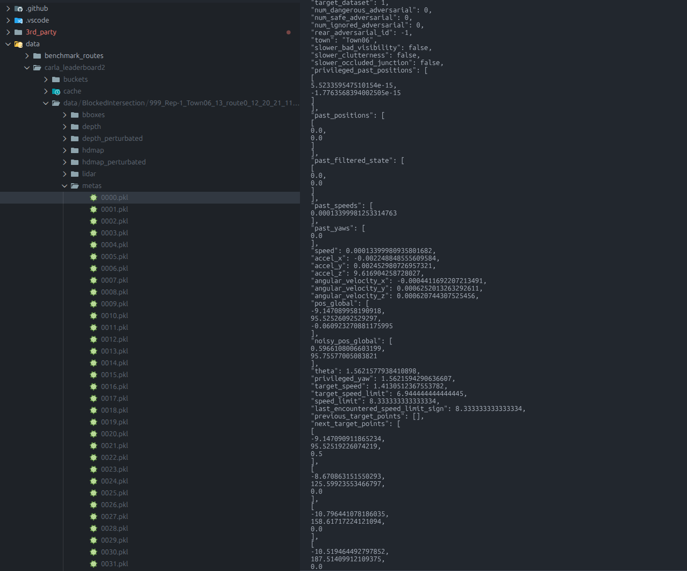

# Inspecting Pickle Files

We compress and store our meta data with lzma and pickle. Empirically this allows us to save most memory.

In order to inspect the pickle data conveniently on VSCode, we recommend [vscode-pydata-viewer](https://marketplace.visualstudio.com/items?itemName=Percy.vscode-pydata-viewer) and this script [3rd_party/vscode_pydata_viewer/view_pickles.py](https://github.com/autonomousvision/lead/blob/main/3rd_party/vscode_pydata_viewer/view_pickles.py). Those two combined allow us to inspect pickle files directly in VSCode

